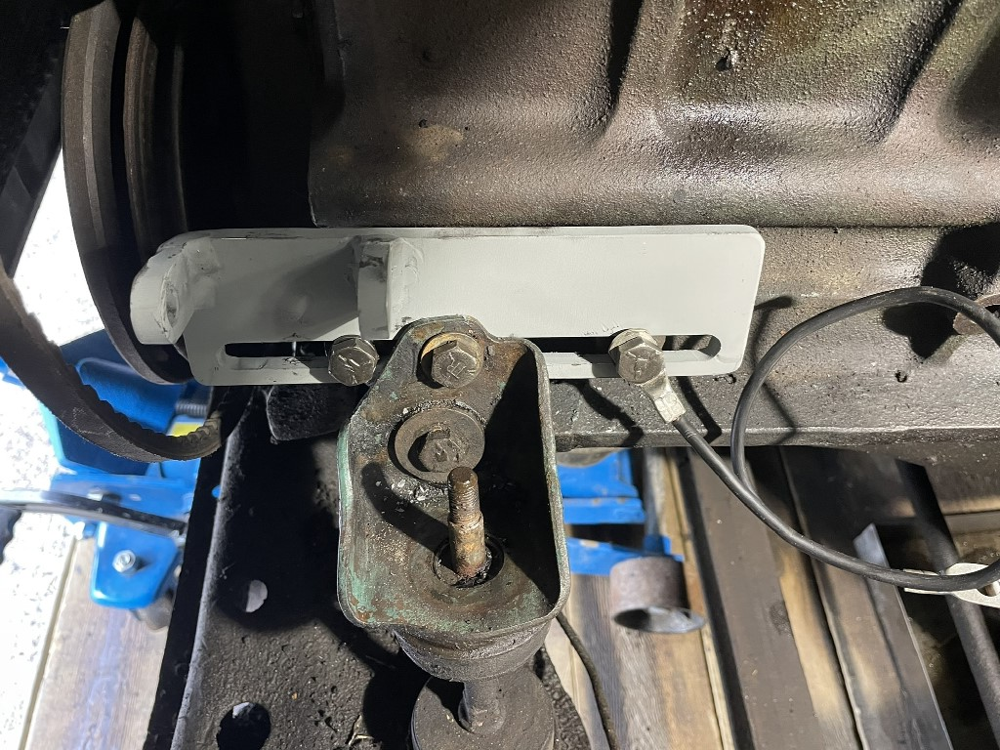
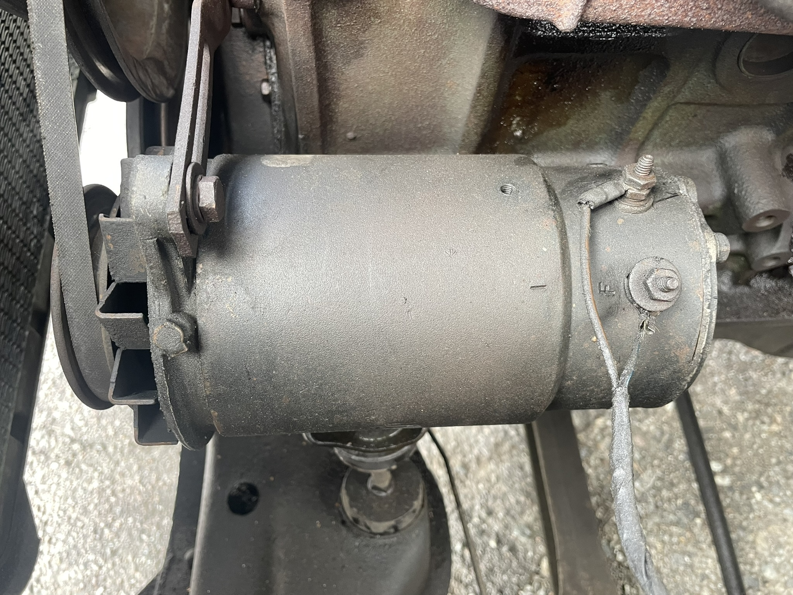

# Chevrolet/GMC Stovebolt inline 6 cylinder engine 1929-1962 - Alternator Mount

At some point these old generators fail, and in order to replace it with a modern 
alternator a mounting bracket is needed.

Here are the files needed, bracket + "ears" to weld on.

Cad files to feed into SheetCam or likewise so that it can be cut by plasma.

New and improved

The old generator setup

